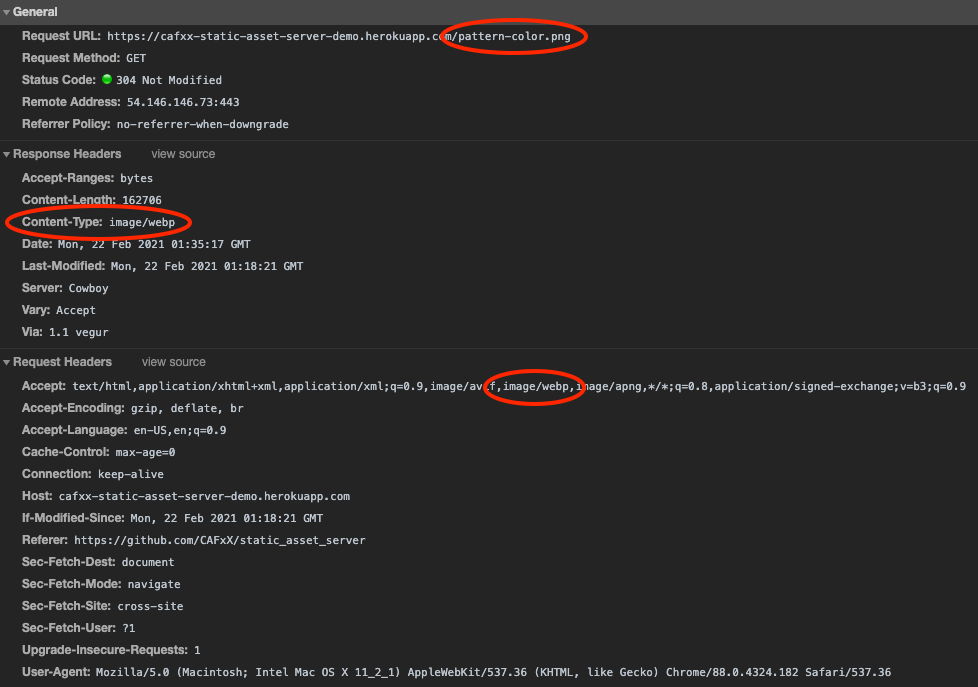

# Static asset server

This repository contains a ahead-of-time static asset optimization pipeline that generates a container image providing a standalone static asset server.

The optimization pipeline, whose responsibility is generating the optimized static assets as well as the index file, is implemented in the `compress.sh` script. This script relies on well-known utilities (e.g. brotli, zopfli, zstd, optipng, mozjpeg, cwebp, gifsicle, svgo, ...) to perform these tasks.

Currently the following optimizations are performed:

- PNG image files are optimized with optipng/zopflipng, and alternate versions are created in AVIF, WebP and JPEG format (the last one only if the PNG file contains no transparent pixels)
- JPEG image files are optimized with mozjpeg and their quality lowered to 85; alternate versions are created in AVIF and WebP format
- GIF image files are optimized with gifsicle, and alternate versions are created in WebP, APNG, PNG (when the image contains a single frame), and JPEG (when the image contains a single frame and no transparency)
- SVG image files are minified using svgo - and are then compressed as other files (see below)
- JSON files are minified using jq - and are then compressed as other files (see below)
- JS files are minified using UglifyJS - and are then compressed as other files (see below)
- Other files are statically compressed with zopfli (gzip), brotli and zstandard (zstd)

The [standalone HTTP server](cmd/server/main.go) is written in Go (with `net/http`) and supports `Content-Type` and `Content-Encoding` negotiation. It expects the optimized static assets to be contained under a root directory, as well as the index file (`alt_path.json`) that lists the relationships (e.g. alternate content type or content encoding) between variants of each asset. The server always returns to the client the smallest variant that the client supports, and supports revalidation/caching using the asset modification date. The appropriate `Vary` header is added to the response to ensure downstream caches can also correctly  perform the content negotiation.

The server can optionally serve the static assets over HTTPS by providing the server image with a certificate and key in `/server.crt` and `/server.key` (it is recommended to mount these as secrets when the container is started, e.g. via Docker [bind mounts](https://docs.docker.com/storage/bind-mounts/) or via Kubernetes [secrets](https://kubernetes.io/docs/concepts/configuration/secret/)).

The server image is based on [`gcr.io/distroless/static:nonroot`](https://github.com/GoogleContainerTools/distroless): as such it contains no shell or other binaries apart from the standalone HTTP server above.

## Usage

The simplest way to use this tool is the following:

1. Ensure you have Docker running
2. Place the static assets in the `webroot` directory
3. Run

   ```bash
   docker build --tag static_asset_builder --file Dockerfile.builder . && \
   docker build . && \
   docker run -p 8080:80 $(docker image ls --format '{{.ID}}' | head -1)
   ```

   Please note that the second step is when asset optimization is performed and may take quite some time depending on how many static assets are present in `webroot`; if you want to speed up this step (at the expense of the compression ratio) you can replace `docker build .` with `docker build --build-arg compression=LOW .`
4. The static asset server should now be running on [localhost:8080](http://localhost:8080) (if you have file `webroot/foo/bar.htm` it should be served as [localhost:8080/foo/bar.htm](http://localhost:8080/foo/bar.htm))

## Examples

The [`assets`](assets) directory contains two subdirectories: [`source`](assets/source) contain random sample files in a variety of different formats, and [`optimized`](assets/optimized) contains the optimized files and the variants that are then served by the static asset server.

The table below shows examples of how assets are optimized and served:

- The "Source" column links to the original asset
- The "Optimized variants" column links to the optimized assets as generated by the optimization pipeline
- The "Live demo" column points to an instance of the static asset server, serving the optimized asset: note that the `Content-Type` and `Content-Encoding` of the response is negotiated dynamically based on the `Accept` and `Accept-Encoding` headers in the request.

When testing the live demo, you can check in the developer console the negotiation result:



<table><thead><tr><th>Source<th>Optimized variants<th>Live demo<tbody>
<tr><td><a href="assets/source/a-chance-of-northern-lights.jpg">a-chance-of-northern-lights.jpg</a> (1479380 bytes)<td>
<a href="assets/optimized/a-chance-of-northern-lights.jpg">a-chance-of-northern-lights.jpg</a> (305538 bytes)<br>
<a href="assets/optimized/a-chance-of-northern-lights.jpg.webp">a-chance-of-northern-lights.jpg.webp</a> (266378 bytes)<br>
<td><a href="https://cafxx-static-asset-server-demo.herokuapp.com/a-chance-of-northern-lights.jpg">a-chance-of-northern-lights.jpg</a>
<tr><td><a href="assets/source/bear.webp">bear.webp</a> (132108 bytes)<td>
<a href="assets/optimized/bear.webp">bear.webp</a> (132108 bytes)<br>
<td><a href="https://cafxx-static-asset-server-demo.herokuapp.com/bear.webp">bear.webp</a>
<tr><td><a href="assets/source/example.json">example.json</a> (3644 bytes)<td>
<a href="assets/optimized/example.json">example.json</a> (2711 bytes)<br>
<a href="assets/optimized/example.json.br">example.json.br</a> (880 bytes)<br>
<a href="assets/optimized/example.json.gz">example.json.gz</a> (990 bytes)<br>
<a href="assets/optimized/example.json.zst">example.json.zst</a> (1011 bytes)<br>
<td><a href="https://cafxx-static-asset-server-demo.herokuapp.com/example.json">example.json</a>
<tr><td><a href="assets/source/gradient.png">gradient.png</a> (3974 bytes)<td>
<a href="assets/optimized/gradient.png">gradient.png</a> (2034 bytes)<br>
<a href="assets/optimized/gradient.png.avif">gradient.png.avif</a> (1628 bytes)<br>
<td><a href="https://cafxx-static-asset-server-demo.herokuapp.com/gradient.png">gradient.png</a>
<tr><td><a href="assets/source/hourglass.gif">hourglass.gif</a> (875 bytes)<td>
<a href="assets/optimized/hourglass.gif">hourglass.gif</a> (746 bytes)<br>
<td><a href="https://cafxx-static-asset-server-demo.herokuapp.com/hourglass.gif">hourglass.gif</a>
<tr><td><a href="assets/source/jquery-1.11.3.js">jquery-1.11.3.js</a> (284394 bytes)<td>
<a href="assets/optimized/jquery-1.11.3.js">jquery-1.11.3.js</a> (95005 bytes)<br>
<a href="assets/optimized/jquery-1.11.3.js.br">jquery-1.11.3.js.br</a> (29849 bytes)<br>
<a href="assets/optimized/jquery-1.11.3.js.gz">jquery-1.11.3.js.gz</a> (31920 bytes)<br>
<a href="assets/optimized/jquery-1.11.3.js.zst">jquery-1.11.3.js.zst</a> (31334 bytes)<br>
<td><a href="https://cafxx-static-asset-server-demo.herokuapp.com/jquery-1.11.3.js">jquery-1.11.3.js</a>
<tr><td><a href="assets/source/kiss.gif">kiss.gif</a> (384825 bytes)<td>
<a href="assets/optimized/kiss.gif">kiss.gif</a> (371623 bytes)<br>
<a href="assets/optimized/kiss.gif.webp">kiss.gif.webp</a> (197796 bytes)<br>
<td><a href="https://cafxx-static-asset-server-demo.herokuapp.com/kiss.gif">kiss.gif</a>
<tr><td><a href="assets/source/make-it-new.jpg">make-it-new.jpg</a> (1084975 bytes)<td>
<a href="assets/optimized/make-it-new.jpg">make-it-new.jpg</a> (369470 bytes)<br>
<a href="assets/optimized/make-it-new.jpg.avif">make-it-new.jpg.avif</a> (357416 bytes)<br>
<a href="assets/optimized/make-it-new.jpg.webp">make-it-new.jpg.webp</a> (338696 bytes)<br>
<td><a href="https://cafxx-static-asset-server-demo.herokuapp.com/make-it-new.jpg">make-it-new.jpg</a>
<tr><td><a href="assets/source/pattern-bw.svg">pattern-bw.svg</a> (75079 bytes)<td>
<a href="assets/optimized/pattern-bw.svg">pattern-bw.svg</a> (65595 bytes)<br>
<a href="assets/optimized/pattern-bw.svg.br">pattern-bw.svg.br</a> (20344 bytes)<br>
<a href="assets/optimized/pattern-bw.svg.gz">pattern-bw.svg.gz</a> (25070 bytes)<br>
<a href="assets/optimized/pattern-bw.svg.zst">pattern-bw.svg.zst</a> (24257 bytes)<br>
<td><a href="https://cafxx-static-asset-server-demo.herokuapp.com/pattern-bw.svg">pattern-bw.svg</a>
<tr><td><a href="assets/source/pattern-color.png">pattern-color.png</a> (326860 bytes)<td>
<a href="assets/optimized/pattern-color.png">pattern-color.png</a> (279412 bytes)<br>
<a href="assets/optimized/pattern-color.png.avif">pattern-color.png.avif</a> (222083 bytes)<br>
<a href="assets/optimized/pattern-color.png.webp">pattern-color.png.webp</a> (162706 bytes)<br>
<td><a href="https://cafxx-static-asset-server-demo.herokuapp.com/pattern-color.png">pattern-color.png</a>
<tr><td><a href="assets/source/reddit.html">reddit.html</a> (982765 bytes)<td>
<a href="assets/optimized/reddit.html">reddit.html</a> (982765 bytes)<br>
<a href="assets/optimized/reddit.html.br">reddit.html.br</a> (180965 bytes)<br>
<a href="assets/optimized/reddit.html.gz">reddit.html.gz</a> (291533 bytes)<br>
<a href="assets/optimized/reddit.html.zst">reddit.html.zst</a> (192423 bytes)<br>
<td><a href="https://cafxx-static-asset-server-demo.herokuapp.com/reddit.html">reddit.html</a>
<tr><td><a href="assets/source/social.png">social.png</a> (93404 bytes)<td>
<a href="assets/optimized/social.png">social.png</a> (68363 bytes)<br>
<a href="assets/optimized/social.png.avif">social.png.avif</a> (36592 bytes)<br>
<a href="assets/optimized/social.png.webp">social.png.webp</a> (41678 bytes)<br>
<td><a href="https://cafxx-static-asset-server-demo.herokuapp.com/social.png">social.png</a>
<tr><td><a href="assets/source/sound-wave.svg">sound-wave.svg</a> (114176 bytes)<td>
<a href="assets/optimized/sound-wave.svg">sound-wave.svg</a> (78778 bytes)<br>
<a href="assets/optimized/sound-wave.svg.br">sound-wave.svg.br</a> (881 bytes)<br>
<a href="assets/optimized/sound-wave.svg.gz">sound-wave.svg.gz</a> (1144 bytes)<br>
<a href="assets/optimized/sound-wave.svg.zst">sound-wave.svg.zst</a> (884 bytes)<br>
<td><a href="https://cafxx-static-asset-server-demo.herokuapp.com/sound-wave.svg">sound-wave.svg</a>
<tr><td><a href="assets/source/terminated.gif">terminated.gif</a> (63849 bytes)<td>
<a href="assets/optimized/terminated.gif">terminated.gif</a> (63849 bytes)<br>
<a href="assets/optimized/terminated.gif.apng">terminated.gif.apng</a> (56056 bytes)<br>
<a href="assets/optimized/terminated.gif.webp">terminated.gif.webp</a> (34418 bytes)<br>
<td><a href="https://cafxx-static-asset-server-demo.herokuapp.com/terminated.gif">terminated.gif</a>
<tr><td><a href="assets/source/wikipedia.html">wikipedia.html</a> (81182 bytes)<td>
<a href="assets/optimized/wikipedia.html">wikipedia.html</a> (81182 bytes)<br>
<a href="assets/optimized/wikipedia.html.br">wikipedia.html.br</a> (15326 bytes)<br>
<a href="assets/optimized/wikipedia.html.gz">wikipedia.html.gz</a> (18541 bytes)<br>
<a href="assets/optimized/wikipedia.html.zst">wikipedia.html.zst</a> (18084 bytes)<br>
<td><a href="https://cafxx-static-asset-server-demo.herokuapp.com/wikipedia.html">wikipedia.html</a>
</table>

## Contributing

PRs are welcome. Some ideas for what to add:

- Add zstd/gzip/brotli dictionary support
- Add dictionary serving
- Add JPEG-XL `jxl` content-encoding variant
- Add LZMA content-encoding variants
- Add WebP optimization
- Add AVIF optimization
- Add AVIF variant for WebP and GIF assets
- Add HEIF (`image/heif`) variants for image assets
- Add JPEG-XL (`image/jxl`) variants for image assets
- Add WebP2 variants for image assets
- Add HTML minification
- Add CSS minification
- Write some tests
- Optionally embed assets in the server binary (`go:embed`)
- Support caching optimization results
- Use unique (guaranteed collision-free) file names for asset variants
- Provide an optional way to sort variants based on a "first contentful paint" criteria (important for image formats that support progressive decoding)
- Add `ETag` support
- Allow to request a specifc content-type or content-encoding via query parameters (e.g. for use with [`source`](https://developer.mozilla.org/en-US/docs/Learn/HTML/Multimedia_and_embedding/Responsive_images#use_modern_image_formats_boldly))
- Allow to request the original/unoptimized asset
- Allow to control optimization on a per-file basis
- Allow to disable optimization of certain formats (e.g. GIF files)
- Allow to disable creation of certain variants (e.g. HEIF variants)
- Automatic generation of lower resoluation variants (e.g. 1x/1.5x from 2x or from CSS-like selectors like `max-width: 640px`)
- Automatic generation of lower quality variants (e.g. q=65, q=85, and lossless)
- Decide whether to add [`Content-Location`](https://developer.mozilla.org/en-US/docs/Web/HTTP/Headers/Content-Location) support
- Add support for [client hints](https://developer.mozilla.org/en-US/docs/Web/HTTP/Headers#client_hints) (e.g. `Save-Data`, `Device-Memory`, `Width`, ...)
- Decide whether to migrate to https://github.com/kevinpollet/nego
